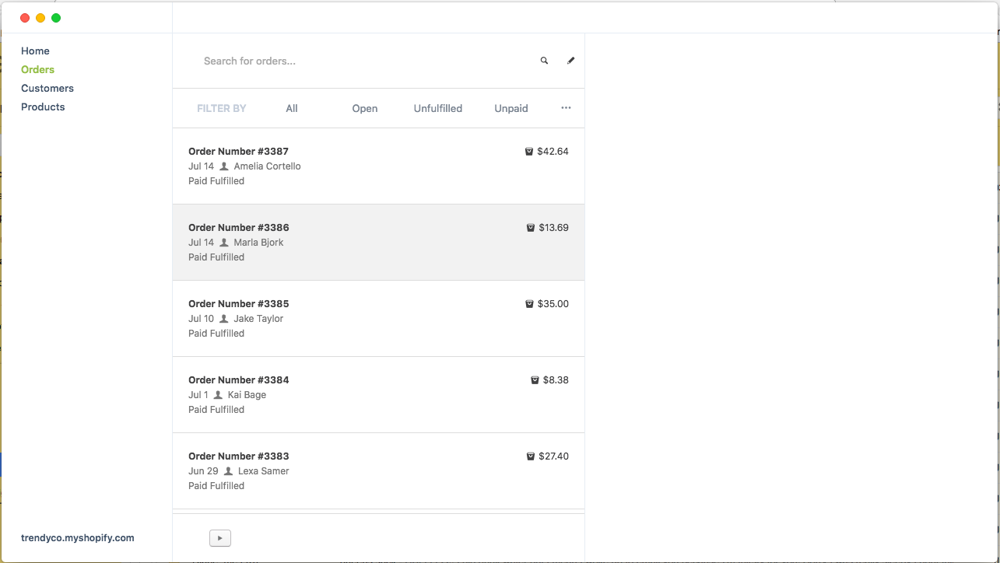

# Shopify Desktop Client (Heavy Work in Progress)  
Shopify Desktop Client written in React, Redux and Electron.

#Set up  
1) Clone the repository  
2) Run "**npm install**"  
3) Run the application with "**npm run dev**"  
4) Rebuild the binaries for sqlite3 against your current OS with "**npm run electron-rebuild**"

#Screen shots  
  
  
